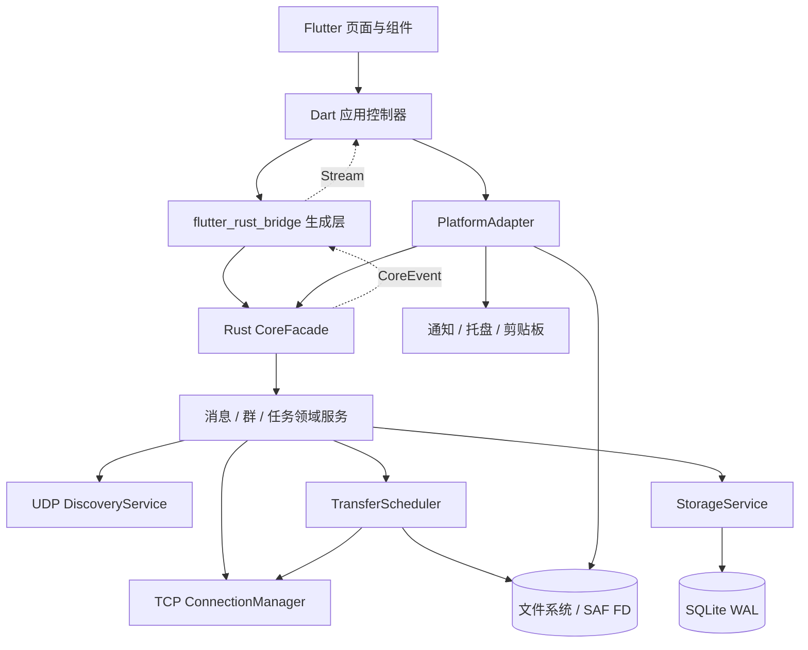
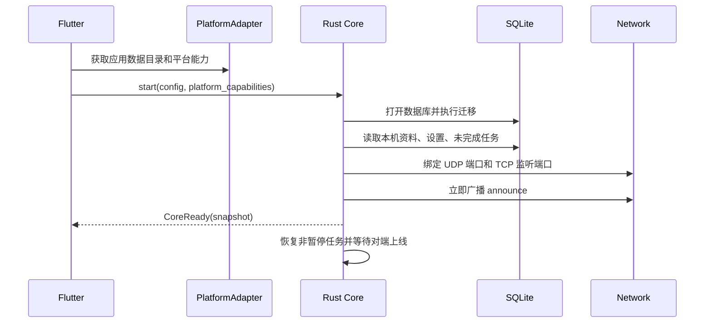

# 总体架构

## 目的

本文档规定 V1 的模块边界、依赖方向、运行线程、数据流和故障边界。实现者可以调整私有函数和目录细节，但不得让 Flutter 处理文件字节流、让平台代码实现协议状态机，或让网络模块直接操作 UI。

状态、接口和错误码见 [数据与 API](04-data-and-api.md)；线上报文见 [网络协议](03-network-protocol.md)。

## 前置知识

- 已阅读 [产品与交互](01-product-ux.md)。
- 理解 Flutter Platform Channel、Rust FFI、Tokio 异步任务和 SQLite 事务的基本概念。
- 理解 Android SAF 返回的是 URI/文件描述符，不一定是普通文件路径。

## 架构规范与目标

1. Windows 与 Android 共用发现、协议、消息、群、任务和数据库逻辑。
2. 文件数据从操作系统文件句柄直接进入 Rust 网络层，不跨越 Dart FFI。
3. UI 随时可以关闭、重建或重新订阅，核心任务不依赖某个页面存在。
4. 网络断开、应用重启和对端重复发送不会产生重复消息或损坏任务。
5. 性能相关代码集中在 Rust 数据通道，能够独立基准测试。
6. 平台差异通过小型适配器暴露，不污染领域模型。

## 逻辑分层



依赖规则：

- Flutter 页面只能调用 Dart 应用控制器，不直接调用 Platform Channel 或拼网络 JSON。
- Dart 应用控制器只能通过生成的桥调用 `CoreFacade`，并把平台事件转成核心命令。
- Rust 领域服务依赖抽象存储、连接和平台句柄，不依赖 Flutter 类型。
- 网络模块只接收和产生协议结构，不读取 SQLite，不更新 UI。
- `StorageService` 是唯一可执行 SQL 的模块。
- 传输数据连接不经过 `CoreEvent`，事件流只发送节流后的数值进度。

## 建议工程模块

本阶段不创建工程；实现时采用以下职责划分。名称是规范的一部分，目录可按语言惯例微调。

```text
app_flutter/
  lib/application/       页面用例、路由、ViewModel、事件订阅
  lib/presentation/      页面与组件
  lib/platform/          通知、托盘、文件选择、剪贴板适配
  android/               Kotlin SAF、前台服务、通知动作
  windows/               Windows 托盘、开机启动、剪贴板辅助

core_rust/
  src/api/               CoreFacade、Command、CoreEvent、DTO
  src/domain/            设备、会话、消息、群、传输实体和用例
  src/discovery/         UDP 广播、在线超时、网络变化重绑
  src/protocol/          JSON 编解码、长度帧、协议限制
  src/connection/        控制连接、握手、保活、重连、去重发送
  src/transfer/          数据连接、文件 I/O、暂停、续传、调度
  src/storage/           SQLite、迁移、仓储和事务
  src/platform/          跨 FFI 文件句柄与平台能力抽象
  src/diagnostics/       tracing、性能计数器、脱敏日志
```

## 运行时与线程

### Rust

Rust 核心在进程内只启动一次，包含：

- 一个 Tokio 多线程运行时，默认工作线程数为 `max(2, min(4, CPU 逻辑核心数))`。
- 一个专用 SQLite 工作线程，通过有界命令队列串行执行 `rusqlite` 操作。
- UDP 接收任务一个、UDP 定时广播任务一个。
- TCP 监听任务一个；每条控制连接各有读任务和写队列。
- 每个活动数据连接一个收或发任务；文件并发受调度器上限控制。
- 文件打开、预分配、刷新、改名等可能阻塞的操作在专用 blocking 线程池执行。

不得：

- 在 Tokio 异步任务中持有 SQLite 锁后等待网络。
- 在 UI 线程读取文件、解析大清单或执行 SQL。
- 为每个 1-4MiB 缓冲块创建新线程或写一次数据库。
- 使用无界 Channel 保存网络消息或进度事件。

### Flutter

- UI Isolate 负责 ViewModel、导航和渲染。
- Rust 事件流由一个应用级订阅接收，再分发到各 ViewModel。
- 页面销毁只取消页面订阅，不停止 Rust 服务或传输任务。
- 大型文件清单在 Rust 中分页查询，Flutter 每次最多加载 100 条显示项。

## 启动顺序



启动失败原则：

- 数据目录不可写、数据库不可打开或迁移失败：核心不进入就绪状态，UI 显示阻断页。
- UDP 绑定失败但 TCP 成功：核心进入降级状态，允许已有设备通过已知地址连接，并持续重试 UDP。
- TCP 监听失败：核心不就绪，因为无法接收消息和文件。
- 单个未完成任务恢复失败：核心继续启动，将该任务标记为需要处理并发出错误事件。

## CoreFacade

`CoreFacade` 是 Flutter 唯一可见的 Rust 入口，职责为：

- 校验命令的基本参数。
- 把命令放入对应领域服务。
- 返回“命令已提交”的结果或同步验证错误。
- 暴露只读 `CoreEvent` 流和分页查询。

命令成功只表示核心已持久化并接受处理，不表示远端已经收到。远端结果必须通过事件和消息状态观察。完整签名见 [数据与 API](04-data-and-api.md#rust-对-flutter-接口)。

## 领域服务

### DeviceService

- 管理本机资料、附近设备、已知设备和我的设备关系。
- 合并同一 `DeviceId` 的 UDP 发现、TCP Hello 和数据库记录。
- 设备显示名变化时更新资料，不创建新设备。
- 按网络时间和控制连接状态计算在线状态。

### ConversationService

- 创建私聊和群聊会话。
- 在一个事务中创建本地消息、逐接收方投递记录和待发送队列。
- 收到远端消息时先按 ID 去重，再落库，再发送回执。
- 维护未读数和最后消息摘要。

### GroupService

- 创建稳定群 ID 和单调递增群版本。
- 只有当前群主可以生成群资料更新。
- 向每名成员分别排队邀请、消息和更新。
- 接收全量群快照并按 [群同步规则](03-network-protocol.md#群资料同步) 应用。
- 群主不在线时不阻塞普通成员消息。

### TransferService 与 TransferScheduler

- `TransferService` 负责状态转换、源文件一致性、接收目录、Offer、暂停和续传。
- `TransferScheduler` 负责并发、公平性、速度统计和资源上限。
- 每个群文件逻辑消息对应每名接收成员一个传输任务；群气泡聚合显示这些任务。
- 调度策略见 [性能规范](06-performance.md#调度策略)。

### ClipboardService

- 保存每设备剪贴板方向设置。
- 只处理平台适配器主动上报的剪贴板变化，不主动读取系统 API。
- 使用来源设备、单调序号和最近应用指纹抑制回环。
- 文本直接走控制连接；图片复用文件 Offer 和数据连接。

## 存储架构

所有持久化使用一个 SQLite 数据库，启用 WAL、foreign keys 和 busy timeout。写操作由专用工作线程串行执行；读操作也通过 `StorageService`，禁止 Flutter 直接打开数据库。

关键事务边界：

1. **发送消息**：插入消息、收件人投递记录和 outbox 后一次提交；提交成功才通知 UI。
2. **接收消息**：检查去重、插入消息、更新会话、记录收件回执后一次提交；提交成功才发网络回执。
3. **创建群**：插入群、成员、会话、邀请 outbox 和系统消息后一次提交。
4. **接受 Offer**：保存接收策略、接收路径、任务状态和初始偏移后一次提交，之后才允许数据连接写入。
5. **完成文件**：文件刷新与原子改名成功后，再提交最终任务状态和回执。

数据库 DDL 和枚举以 [数据与 API](04-data-and-api.md) 为准。

## 网络架构

### UDP 发现

- 同一进程绑定固定 UDP 端口。
- 启动、手动刷新和网络变化时立即广播。
- 对 `discover` 单播响应 `announce`。
- 发现只决定“可能在线”；已建立控制连接的保活拥有更高可信度。

### TCP 控制连接

- 每对设备尽量只保留一条长期连接。
- 所有业务控制消息先落入 outbox，再由连接发送。
- 收到回执后清除 outbox；连接断开后未回执消息重新排队。
- 对端按事件 ID 去重，因此重发不会产生重复消息。

### TCP 数据连接

- 每个活动传输任务使用一条短期数据连接。
- 数据连接复用同一 TCP 监听端口，通过首个 JSON 头区分角色。
- 文件夹清单显式包含 file/directory entry；接收端先创建目录，数据连接只依次发送 file entry 的记录和原始字节，因此空目录也能保留。
- 暂停、取消或网络断开时关闭数据连接；恢复时从接收端确认的连续偏移继续。
- 文件字节不进入 JSON、不进入 SQLite、不进入 Flutter。

## 文件句柄边界

### Windows

Flutter 文件选择器返回规范化路径；Rust 自己以只读方式打开源文件或在接收目录创建临时文件。路径只在 FFI 中传一次。

### Android

1. Flutter/Kotlin 通过 SAF 获得 `content://` URI。
2. Kotlin 使用 `ParcelFileDescriptor` 打开并 `detachFd()`。
3. 通过 FFI 把整数 FD、显示名称、大小和修改时间交给 Rust。
4. Rust 立即复制/接管 FD 所有权；原始 Kotlin 对象不得再次关闭已分离 FD。
5. Rust 直接读取或写入 FD，文件内容不经过 Dart `Uint8List`。

目录接收采用持久化 SAF Tree URI。Rust 不能直接拼 `content://` 子路径；平台适配器负责按相对路径创建文档并返回 FD。

## 事件流和背压

`CoreEvent` 分为两类：

- 不可合并事件：新消息、邀请、需要用户确认、错误、任务完成。
- 可合并事件：设备在线状态、传输字节数、速度和剩余时间。

规则：

- Rust 到 Flutter 使用容量 1,024 的有界事件队列。
- 不可合并事件必须落库，队列满时由 UI 通过快照补取，不得丢失业务状态。
- 同一传输的进度事件在 Rust 内每 250ms 最多发送一次，队列拥塞时保留最新值。
- Flutter 恢复前台或事件流重连后，必须请求一次 `get_app_snapshot()` 校正所有页面。

## 错误与恢复边界

| 故障位置 | 恢复责任 |
|---|---|
| UDP 发现 | DiscoveryService 定时重绑；UI 提供刷新 |
| 控制连接 | ConnectionManager 指数退避重连；outbox 保留 |
| 畸形控制帧 | Protocol 层拒绝该帧并记录错误；严重时关闭对端连接 |
| 数据连接断开 | TransferService 保存连续偏移并等待重连 |
| SQLite 写失败 | StorageService 回滚事务；领域服务不发布成功事件 |
| 源文件变化 | TransferService 停止并要求重新选择 |
| 接收目录授权失效 | PlatformAdapter 请求用户重新授权 |
| UI 崩溃或重建 | Rust 核心继续任务；新 UI 通过快照恢复 |
| 进程退出 | 下次启动从 SQLite 和 `.partial` 文件恢复 |

## 日志与诊断

- 使用结构化 `tracing` 日志，字段包含事件名、设备 ID 后八位、会话 ID、传输 ID、耗时和错误码。
- 不记录文字正文、剪贴板内容、完整本地路径或文件字节。
- 普通级别记录状态转换和连接摘要；调试级别记录协议消息类型和长度，不记录正文。
- 传输完成时记录总字节、总耗时、平均速度、重连次数和数据库写次数。
- 日志文件滚动上限为 10MiB × 3；用户可从设置页导出。

## 推荐依赖

Rust 实现优先选用成熟库，不自行实现运行时或 SQLite 驱动：

- `tokio`：异步运行时和 TCP/UDP。
- `socket2`：Socket 选项和缓冲区。
- `serde`、`serde_json`：协议结构。
- `rusqlite`：SQLite。
- `uuid`：UUIDv7 消息与任务 ID。
- `thiserror`：内部错误。
- `tracing`、`tracing-subscriber`：结构化日志。
- `flutter_rust_bridge`：Flutter/Rust 接口生成。

依赖版本在创建工程时统一锁定；不得在 Flutter 和 Rust 各实现一套协议模型。

## 示例：发送离线文件

```text
Flutter 选择文件路径
  -> CoreFacade.send_files()
  -> TransferService 检查元数据并在事务中创建 message/transfer/outbox
  -> CoreEvent.MessageChanged(queued)
  -> 对端离线，调度器保持 queued
  -> UDP 发现对端上线
  -> ConnectionManager 建立控制连接并发送 file_offer
  -> 对端落库并按策略接受
  -> 对端发送 file_accept(offset=0)
  -> TransferScheduler 打开数据连接并由 Rust 读取文件
  -> 每 250ms 上报聚合进度，每 1s 或 64MiB 持久化偏移
  -> 接收端刷新、原子改名、提交 completed
  -> completed 回执更新发送端投递记录
```

## 异常情况

- 同一设备同时发起两条控制连接：按协议的连接选择规则保留一条，outbox 不绑定某个 Socket。
- Flutter 重复提交同一个用户操作：命令携带 `client_operation_id`，核心幂等返回已有结果。
- 数据库可写但接收目录不可写：允许文字消息继续，文件 Offer 进入需要用户选择目录状态。
- 设备名称相同：领域层按 DeviceId 合并，UI 在歧义时显示 ID 后四位。
- Android FD 在传输前失效：平台错误映射为权威错误码，任务要求重新选择，不尝试读空数据。
- 群成员数量达到 32：创建或邀请命令同步拒绝，不产生部分更新。

## 实现检查表

- [ ] Flutter 页面没有直接读写 Socket、SQLite 或文件字节。
- [ ] Rust 核心可以在没有 Flutter 页面时继续运行和测试。
- [ ] SQL 只存在于 StorageService 与迁移代码中。
- [ ] 网络层不依赖 UI DTO，领域层不依赖 Flutter 类型。
- [ ] 业务事件先落库再回执，进度事件按 250ms 合并。
- [ ] Android 文件内容不经过 Dart 内存。
- [ ] 群文件按成员拆分传输任务，气泡只做聚合。
- [ ] 关闭控制或数据连接不会删除 outbox 或 partial 文件。
- [ ] 所有启动降级和阻断条件都有对应 UI 事件。
- [ ] 日志不包含消息正文、剪贴板正文和完整路径。
